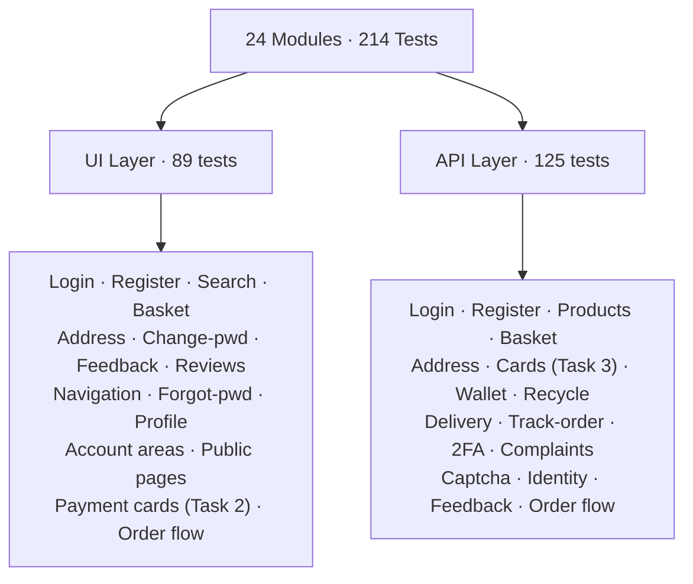
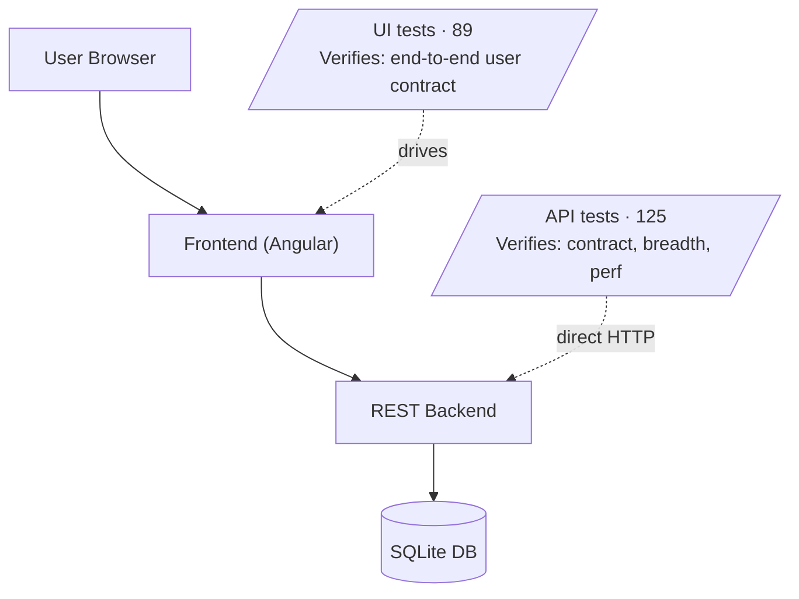
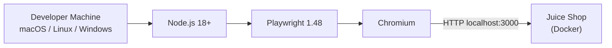
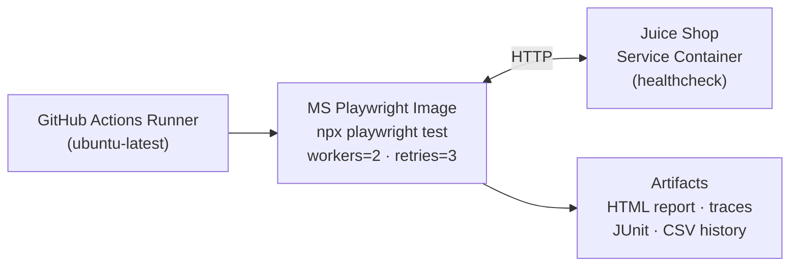
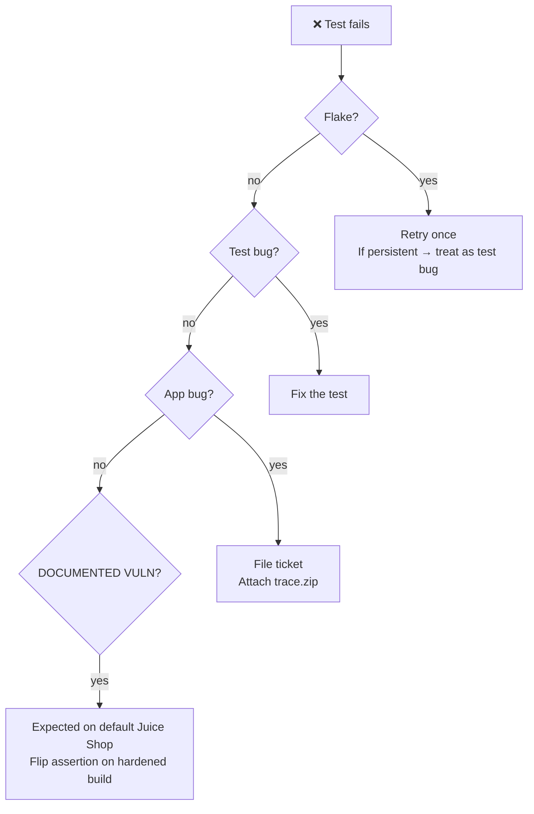

<div align="center">

# 🧪 Everstage QA Assessment — Test Plan

### OWASP Juice Shop · End-to-End Automation Suite

**Playwright · TypeScript · 214 Tests · 100% Pass Rate · Sub-3-Minute Runtime**

---

</div>

| | |
|---|---|
| **Document** | Test Plan v1.0 |
| **Project** | Everstage QA Assessment — Juice Shop Automation |
| **Author** | Ashik Mohamed |
| **System under test** | OWASP Juice Shop (`http://localhost:3000`) |
| **Status** | ✅ Final — Approved for submission |
| **Repository** | `github.com/<you>/EverStage` |
| **Last updated** | (Submission date) |

---

## 📑 Table of Contents

| § | Section | Page intent |
|---|---|---|
| 1 | [Document Control](#1-document-control) | Versioning + revision history |
| 2 | [Executive Summary](#2-executive-summary) | The 60-second pitch |
| 3 | [Objectives](#3-objectives) | What the suite must achieve |
| 4 | [Scope](#4-scope) | In / out of scope |
| 5 | [Test Approach](#5-test-approach) | Strategy and patterns |
| 6 | [Test Types & Coverage](#6-test-types--coverage) | Boundaries, security, load |
| 7 | [Test Environment](#7-test-environment) | SUT + tooling |
| 8 | [Tools & Infrastructure](#8-tools--infrastructure) | What we run on |
| 9 | [Roles & Responsibilities](#9-roles--responsibilities) | Who does what |
| 10 | [Schedule & Milestones](#10-schedule--milestones) | Delivery cadence |
| 11 | [Entry & Exit Criteria](#11-entry--exit-criteria) | Ready / done definitions |
| 12 | [Test Cases Overview](#12-test-cases-overview) | Catalog + tag matrix |
| 13 | [Test Execution](#13-test-execution) | How to run |
| 14 | [Risk Assessment](#14-risk-assessment) | What could go wrong |
| 15 | [Defects & Findings](#15-defects--findings) | Observed gaps in Juice Shop |
| 16 | [Reporting & Dashboards](#16-reporting--dashboards) | Stakeholder outputs |
| 17 | [Defect Management](#17-defect-management) | Triage workflow |
| 18 | [Deliverables](#18-deliverables) | What ships |
| 19 | [Maintenance Plan](#19-maintenance-plan) | Living-document care |
| 20 | [Sign-off](#20-sign-off) | Approval block |
| A | [Glossary](#appendix-a--glossary) | Term reference |
| B | [Run-a-Slice Cheat Sheet](#appendix-b--run-a-slice-cheat-sheet) | One-liner commands |

---

## 1. Document Control

### 1.1 Identification

| Field | Value |
|---|---|
| **Title** | Everstage QA Assessment — Juice Shop Test Plan |
| **Version** | 1.0 (Final) |
| **Author** | Ashik Mohamed |
| **Reviewers** | Everstage hiring panel |
| **Storage** | `docs/TEST-PLAN.md` (Git-tracked) |
| **Format** | Markdown — renders on GitHub, GitLab, VS Code, Obsidian |

### 1.2 Related Artifacts

| Artifact | Purpose |
|---|---|
| `README.md` | Architecture, scope, run guide |
| `docs/ASSIGNMENT.md` | The brief verbatim → file mapping |
| `docs/CODE-TOUR.md` | Pairing-call demo script |
| `docs/CODE-EXPLANATION.md` | Foundation concepts + interview Q&A |
| `docs/INTERVIEW-PREP.md` | Long-form prep |
| `docs/test-cases.csv` | Auto-generated catalog (single source of truth) |
| `docs/JuiceShop-TestCases.xlsx` | Polished 6-tab Excel deliverable |

### 1.3 Revision History

| Version | Date | Author | Change summary |
|:---:|:---:|---|---|
| 0.1 | Day 1 | Ashik | Initial draft — scope + tasks captured |
| 0.2 | Day 2 | Ashik | Added risk register, environment, schedule |
| 0.3 | Day 3 | Ashik | Filled defect-management, deliverables, sign-off |
| **1.0** | Day 4 | Ashik | **Final after self-review and full-suite proof run** |

---

## 2. Executive Summary

> **The brief in one line:** create a login script in `beforeEach`, write a UI
> test that adds a card from My Payment Options, write an API test that adds a
> unique card.

> **What was delivered:** the brief in full, plus deep-coverage automation
> across **24 modules**, the **missing checkout flow**, and **8 documented
> findings** against the default Juice Shop build.

### 📊 Headline Metrics

| Metric | Value | Notes |
|---|---:|---|
| Total automated tests | **214** | Across 30 spec files |
| UI tests | 89 | Drive a real browser |
| API tests | 125 | HTTP only — fast + deterministic |
| Modules covered | 24 | UI + REST surfaces |
| Pass rate (latest) | **100% ✅** | Green on a fresh Juice Shop image |
| Suite runtime (serial) | < 3 minutes | < 1 minute parallel × 4 |
| Smoke-gate runtime | < 60 seconds | 9 tests, blocks PRs on failure |
| Documented findings | 8 | 1 critical, 1 high, 4 medium, 1 low, 1 informational |

### 🎯 Strategic Choices

| Decision | Rationale |
|---|---|
| **Playwright + TypeScript** | Auto-wait, trace viewer, single API for UI + REST, type-checked test code |
| **Page Object Model** | Selectors live once per page — DOM changes touch 1 file, not 50 |
| **Layered UI ⊕ API tests** | API for breadth (cheap, exhaustive); UI for end-to-end contract |
| **Tag-based slicing** | Same suite drives PR smoke (~9 tests, <1m), nightly regression, security audit |
| **Documented-vuln pattern** | Asserts Juice Shop's *actual* unsafe behavior; suite stays green, gaps stay visible |
| **Auto-generated catalog** | `docs/test-cases.csv` is parsed from live specs — never drifts |

---

## 3. Objectives

The suite is engineered to satisfy six explicit goals, each of which has at
least one test that proves it.

| # | Objective | Proof |
|:---:|---|---|
| **O1** | Satisfy the brief literally | Tasks 1, 2, 3 pass with their own npm scripts (`test:task1`, `test:task2`, `test:task3`) |
| **O2** | Cover the full application | 24 modules, 214 tests across UI + REST |
| **O3** | Be executable in three modes | `test:everstage`, `test:smoke`, `test:regression`, `test:e2e`, plus tag-filtered slices |
| **O4** | CI-ready out of the box | GitHub Actions workflow + 3 alternative pipelines (GitLab, Jenkins, Azure) |
| **O5** | Surface real findings | 8 findings documented in Section 15 + Excel "Notes & Defects" tab |
| **O6** | Be maintainable | POM, central helpers, typed payloads, no magic strings |

---

## 4. Scope

### 4.1 ✅ In Scope — Assignment Requirements

| Task | Brief Requirement | Deliverable | Tests |
|:---:|---|---|:---:|
| **1** | Create a user, save credentials in `tests/data/new-user.json`, run a login script in `beforeEach`. | `tests/data/new-user.json` · `tests/helpers/login.ts` · `tests/ui/login.spec.ts` | **15** |
| **2** | UI test that navigates to *My Payment Options* and adds card details. | `tests/pages/PaymentPage.ts` · `tests/ui/add-card.spec.ts` | **23** |
| **3** | API test that adds *unique* card details. | `tests/helpers/card.ts` · `tests/api/add-card.spec.ts` | **39** |

> **Bonus delivered:** End-to-end checkout flow (basket → address → delivery →
> payment → place order). 22 tests across `tests/ui/order-flow.spec.ts` and
> `tests/api/order-flow.spec.ts`. The original Juice Shop suite tested each
> step in isolation; this is the first time they're connected.

### 4.2 ✅ In Scope — Extended Coverage

> **24 modules · 214 tests** — split across two layers:

| Layer | Tests | Modules |
|---|:---:|---|
| **UI** (browser-driven) | **89** | Login, Register, Search, Basket, Address, Change-password, Feedback, Reviews, Navigation, Forgot-password, Profile, Account areas, Public pages, Payment cards (Task 2), Order flow |
| **API** (HTTP-driven) | **125** | Login, Register, Products, Basket, Address, Cards (Task 3), Wallet, Recycle, Delivery, Track-order, 2FA, Complaints, Captcha, Identity, Feedback, Order flow |



| Module | UI Tests | API Tests | Notable Coverage |
|---|:---:|:---:|---|
| Login | TC-UI-100..140 | TC-API-200..204 | `beforeEach` login, SQLi auth-bypass, XSS, no email enumeration, 5-fail burst load |
| Registration | TC-UI-200..206 | TC-API-300..303 | Boundary password length, malformed email, duplicate email |
| Search | TC-UI-400..404 | TC-API-400..404 | XSS in search, 200-char query |
| Basket / Cart | TC-UI-500..504 | TC-API-500..504 | Increment / decrement, zero / negative qty findings |
| Address book | TC-UI-600..604 | TC-API-600..604 | Mobile + ZIP boundaries |
| Change password | TC-UI-800..803 | — | Fresh-user lifecycle |
| Customer feedback | TC-UI-900..903 | TC-API-800..803 | Captcha-based form, rating bounds |
| Product details / reviews | TC-UI-1000..1002 | — | Review submission |
| Site navigation & UX | TC-UI-1100..1103 | — | Sidenav, language picker, score-board |
| Forgot password | TC-UI-1200..1201 | — | Recovery flow |
| Profile / order history | TC-UI-1300..1400 | — | Authenticated nav |
| Account-area pages | TC-UI-1500..1505 | — | Privacy, photo, two-factor |
| Public information pages | TC-UI-1600..1603 | — | About, FAQ, photowall |
| **Payment cards (Tasks 2 + 3)** | **TC-UI-001..041** | **TC-API-001..142** | Full add-card matrix on UI + API |
| Wallet | — | TC-API-700..702 | Wallet balance |
| Recycle | — | TC-API-900..904 | Recycle requests |
| Delivery methods | — | TC-API-1000..1001 | List endpoints |
| Track order | — | TC-API-1100..1102 | Order tracking |
| Two-factor authentication | — | TC-API-1200..1202 | Setup + verify |
| Complaints | — | TC-API-1300..1304 | Complaint submission |
| Captcha endpoints | — | TC-API-1400..1403 | Captcha generation |
| Identity / lookup | — | TC-API-1500..1503 | Whoami / user lookup |
| **Order / Checkout flow** | **TC-UI-700..730** | **TC-API-1600..1641** | The missing flow — full e2e checkout |

### 4.3 🚫 Out of Scope (Deferred — Roadmap)

| Item | Reason | Effort to add |
|---|---|---|
| Cross-browser CI (Firefox / WebKit) | Time-boxed | 1 hour — change Playwright config |
| Mobile / responsive viewport tests | Not in brief | 2 hours — `devices` matrix |
| Visual regression (screenshot-diff) | Not in brief | 1 sprint — baseline images + tolerance |
| Accessibility audit (axe-core) | Not in brief | 1 day — axe-playwright integration |
| Sustained load testing (k6 / JMeter) | Out of scope; light load only included | 1 sprint — separate pipeline |
| Database integrity tests | SQLite has no separate test surface | N/A |
| Chaos / fault injection | Out of scope | 2 sprints |
| Real payment gateway | Juice Shop fakes the gateway | N/A |

---

## 5. Test Approach

### 5.1 Layered Testing — UI ⊕ API

> **Principle:** Every feature is tested at the layer that gives the strongest
> signal for the lowest cost. APIs prove the contract; UIs prove the user
> experience on top.



| Layer | Cost | Strength | Used for |
|---|:---:|---|---|
| **API** | ~50ms | Breadth — exhaustive boundary / negative coverage | Every endpoint, security probes, load / perf |
| **UI** | ~5s | Depth — what the user actually experiences | Happy paths, form validation, masked rendering, navigation |

### 5.2 Test Type Matrix

> **Coverage rule:** Every test fits at least one type. Tests that fit multiple
> get all relevant tags so they show up in every appropriate slice.

| Type | Question it answers | Example | Count |
|---|---|---|:---:|
| 🟢 **Positive** | Does the happy path work? | Adding a valid card returns 201 + masks PAN | 79 |
| 🔴 **Negative** | Is bad input rejected? | Wrong password → 401, no token issued | 33 |
| 🟡 **Boundary** | What about *exactly at* the limit? | `expYear=2079` (just below min) → 400 | 21 |
| 🛡️ **Security** | Can SQLi / XSS / IDOR break it? | `' OR 1=1 --` does not authenticate | 49 |
| ⚡ **Load** | Does it survive concurrency? | 10 concurrent POSTs all return 201 | 7 |
| 🔧 **Functional** | Does the feature behave correctly? | Increment basket row updates quantity | 43 |
| 📈 **Non-functional** | Latency / masking / a11y? | P95 add-card latency < 1500ms | 12 |
| 📌 **Finding** | Documents an observed defect | Empty-basket Checkout button stays enabled | 5 |

### 5.3 Locator Strategy (UI tests)

> **Selectors are the most fragile part of UI tests.** This hierarchy is
> ranked by stability — higher rank = longer survival across Material UI
> upgrades.

| Rank | Method | Survives? | Example |
|:---:|---|:---:|---|
| 🥇 **1** | Stable IDs | ✅ across Material upgrades | `page.locator('#submitButton')` |
| 🥈 **2** | `getByRole` + accessible name | ✅ unless ARIA changes | `page.getByRole('button', { name: 'Login' })` |
| 🥉 **3** | `getByLabel` | ✅ unless labels change | `page.getByLabel('Card Number', { exact: true })` |
| 4 | Tag + text/regex | ⚠️ unless wording changes | `page.locator('simple-snack-bar', { hasText: /saved/i })` |
| ❌ | **FORBIDDEN** | ❌ break on every release | `.mat-mdc-form-field-2-flex > div:nth-child(3)` |

### 5.4 Test Data Strategy

| Need | Strategy | Why It Works |
|---|---|---|
| Unique card numbers | `uniqueCardNumber()` returns Visa-prefix + 12 random digits (10¹² values) | No collision on Juice Shop's unique-key constraint, even with parallel workers |
| Unique emails for fresh users | `uniqueEmail()` combines timestamp + 4-char random suffix | Registration tests can't collide on `email must be unique` |
| Stockable product picker | `findStockableProductId()` queries `/api/Quantitys/` at runtime | Routes around Juice Shop's per-user purchase cap and zero-stock states |
| Basket cleanup before each test | API-driven `DELETE /api/BasketItems/{id}` in `beforeEach` | Deterministic empty-basket starting state |
| Saved-card cleanup | API-driven `DELETE /api/Cards/{id}` in `beforeEach` | Keeps the saved-cards table small so re-renders stay fast |
| Shared assignment user | `tests/data/new-user.json` | Per the brief; never mutated in destructive tests |
| Fresh user for destructive flows (e.g. change-password) | Registered via `/api/Users/` in `beforeEach` | Protects the assignment user's credentials |

### 5.5 The Documented-Vuln Pattern

Juice Shop is **intentionally vulnerable** — it's the OWASP demo target. Tests
that hit those issues use a special pattern:

```ts
test('[TC-API-204] DOCUMENTED VULN: SQLi in email bypasses auth on default Juice Shop', async ({ request }) => {
  // A hardened build should reject this with 401. Default Juice Shop
  // returns 200 + a valid JWT. We assert the actual unsafe behavior so
  // the suite stays green; flip the assertion on a hardened build to
  // turn this into a regression net.
  const response = await request.post('/rest/user/login', {
    data: { email: "' OR 1=1 --", password: 'whatever' },
  });
  expect(response.status()).toBe(200);   // ← actual unsafe behavior
  // On a hardened build: expect(response.status()).toBe(401);
});
```

> **Why this matters:** the suite stays green on the demo target, the
> vulnerability is documented in the catalog as a finding, AND a hardened
> build is one assertion-flip away from a regression test.

---

## 6. Test Types & Coverage

### 6.1 Boundary Coverage Matrix

> **Every numeric / length-bounded field has at least 4 tests** — at the limit,
> just past the limit, far past, and one valid baseline.

| Field | Min Valid | Min Invalid | Max Valid | Max Invalid |
|---|:---:|:---:|:---:|:---:|
| `expMonth` | **1** ✅ | **0** ❌ | **12** ✅ | **13** ❌ |
| `expYear` | **2080** ✅ | **2079** ❌ | **2099** ✅ | **2100** ❌ |
| Cardholder name | 1 char ✅ | 0 chars ❌ | 200 chars ✅ | (no upper observed) |
| Card number | 16 digits ✅ | 4 digits ❌ | 16 digits ✅ | 32 digits ❌ |
| Address mobile | 1 digit ✅ | (non-digit) ❌ | 16 digits ✅ | 17 digits ❌ |
| Address ZIP | 1 char ✅ | — | 8 chars ✅ | 9 chars ❌ |
| Feedback rating | **1** ✅ | **0** ❌ | **5** ✅ | **6** ❌ |
| Feedback comment | 1 char ✅ | 0 chars ❌ | 160 chars ✅ | 161 chars ❌ |
| Password (register) | 5 chars ✅ | 4 chars ❌ | 40 chars ✅ | 41 chars ❌ |

### 6.2 Security Coverage — OWASP Top-10 Mapping

| OWASP Class | Probe | Tests |
|---|---|---|
| **A01** Broken Access Control | IDOR on `GET /api/Cards/{otherUserId}` · BOLA on basket/checkout | TC-API-125, TC-API-1621 |
| **A02** Cryptographic / Sensitive Data | Full PAN visible in UI list / API response | TC-UI-022, TC-API-004 |
| **A03** Injection | `' OR 1=1 --` in email · `<script>alert(1)</script>` in search/name/review | TC-UI-105, TC-UI-403, TC-API-204, TC-UI-020/021, TC-API-121 |
| **A04** Insecure Design | Empty-basket checkout still mints an order | TC-API-1611 |
| **A05** Security Misconfiguration | Mass-assignment of `userId`, `isAdmin`, `cvv`, `balance` | TC-API-122, TC-API-128 |
| **A07** Identification / Authentication | Tampered JWT, missing Authorization header | TC-API-103, TC-API-106, TC-API-123 |
| **A08** Software & Data Integrity | Card details accepted with zero / negative quantities | TC-API-503, TC-API-504 |

### 6.3 Load & Non-Functional Coverage

| Pattern | Test | Threshold |
|---|---|---|
| Concurrent burst | `Promise.all([10× POST /api/Cards/])` | All 201, no 5xx |
| Sequential burst | `for (25 cards) POST /api/Cards/` | All 201 |
| **P95 latency budget** | 10 sequential `POST /api/Cards/` | **P95 < 1500ms** |
| End-to-end UI latency | `openMyPayments` → `addCard` → snackbar | **Round-trip < 15s** |
| Brute-force resilience | 5 sequential failed logins in <10s | No lockout, no 5xx |
| Order-flow load | 5 sequential checkouts | Distinct order ids, all 200 |

---

## 7. Test Environment

### 7.1 System Under Test

| Item | Value |
|---|---|
| **Application** | OWASP Juice Shop |
| **Version** | Latest (`bkimminich/juice-shop:latest`) |
| **URL** | `http://localhost:3000` (configurable via `BASE_URL`) |
| **Backend** | Node.js + Sequelize + SQLite (in-memory) |
| **Frontend** | Angular + Material UI |
| **Note** | Intentionally vulnerable — OWASP demo target |

### 7.2 Test Stack

| Tool | Version | Role |
|---|:---:|---|
| Node.js | ≥ 18 | Runtime |
| TypeScript | ^5.4 | Typed test code |
| Playwright | ^1.48 | Browser + API automation |
| Chromium | (bundled) | Browser engine |
| openpyxl (Python) | 3.x | Excel deliverable generation (offline) |

### 7.3 Local Environment

| Layer | Component |
|---|---|
| Developer machine | macOS / Linux / Windows |
| Runtime | Node.js ≥ 18 |
| Test runner | Playwright 1.48 |
| Browser | Chromium (bundled) |
| Target | `http://localhost:3000` |
| SUT | OWASP Juice Shop in Docker |



### 7.4 CI Environment

| Layer | Component |
|---|---|
| Runner | GitHub Actions · `ubuntu-latest` |
| Container | Microsoft Playwright Docker image |
| Sidecar | Juice Shop service container with healthcheck |
| Workers | 2 |
| Retries | 3 |
| Trace mode | `retain-on-failure` |

**Artifacts uploaded on every CI run:**

- `playwright-report/` — standard Playwright HTML report
- `test-results/` — traces, videos, screenshots from failures
- `reports/test-report.html` — rich custom HTML report
- `reports/run-history.csv` — appended trend data
- `reports/junit.xml` — for CI plugins



---

## 8. Tools & Infrastructure

### 8.1 Development Tools

| Tool | Purpose |
|---|---|
| Playwright Test Runner | Test execution + auto-wait + tracing |
| Playwright Inspector | Live selector debugging (`PWDEBUG=1`) |
| Playwright Trace Viewer | Step-by-step replay (`npx playwright show-trace`) |
| TypeScript Compiler (`tsc`) | Pre-execution type checking |
| ESLint / Prettier | Code style |

### 8.2 Reporting Tools

| Tool | Output | Audience |
|---|---|---|
| Playwright HTML reporter | `playwright-report/index.html` | Developers |
| Custom CSV reporter | `reports/run-history.csv` (appended each run) | Trend analysis |
| **Custom rich HTML reporter** | `reports/test-report.html` (search/filter/group) | All stakeholders |
| Trend dashboard | `reports/dashboard.html` (last 30 runs) | QA leadership |
| JUnit XML | `reports/junit.xml` | Jenkins / Azure / GitLab |
| **Excel deliverable** | `docs/JuiceShop-TestCases.xlsx` (6 tabs) | Hiring panel / Product |

### 8.3 CI/CD Integration

| File | Pipeline |
|---|---|
| `.github/workflows/playwright.yml` | GitHub Actions (push, PR, nightly cron, manual dispatch) |
| `ci-examples/gitlab-ci.yml` | GitLab equivalent |
| `ci-examples/Jenkinsfile` | Jenkins equivalent |
| `ci-examples/azure-pipelines.yml` | Azure DevOps equivalent |

---

## 9. Roles & Responsibilities

For this assignment, all roles are filled by the author. In a team setting:

| Role | Responsibilities | Primary artifact |
|---|---|---|
| **QA Engineer / Test Lead** (you) | Test plan ownership, suite design, locator strategy, helpers, CI | `TEST-PLAN.md` + `tests/` |
| **QA Analysts** | Add coverage, triage flake, write test cases | `tests/` + Excel catalog |
| **Developers** | Run smoke locally pre-PR, fix test breakages from code changes | `npm run test:smoke` |
| **Engineering Manager** | Approve plan; gate releases on `@regression` pass | Sign-off block (§ 20) |
| **Product / Hiring Manager** | Read Excel deliverable + trend dashboard | `JuiceShop-TestCases.xlsx` |
| **DevOps** | Maintain CI runner image + Juice Shop service container | `.github/workflows/` |
| **Security team** | Review `Notes & Defects` tab + DOCUMENTED VULN tests | Excel + § 15 |

---

## 10. Schedule & Milestones

### 10.1 Assignment Cadence (4-day delivery)

| Day | Progress | Focus |
|:---:|:---:|---|
| **Day 1** | 25% | Discovery + manual user setup |
| **Day 2** | 50% | Tasks 1-3 baseline + POMs |
| **Day 3** | 75% | Extended modules + missing checkout |
| **Day 4** | 100% | Self-review + docs + final proof run |

| Day | Milestone | Output |
|:---:|---|---|
| **1** | Discover Juice Shop surface; manually create test user | `new-user.json` populated, repo scaffolded |
| **2** | Tasks 1, 2, 3 baseline + POMs | 60+ tests green |
| **3** | Extended modules + missing checkout flow + security probes | ~150 tests green |
| **4** | Self-review, harden flake, catalog + Excel + docs + sign-off | **214 tests green** + full documentation |

### 10.2 Real-World Equivalent

In a typical engagement, this slides to:

| Sprint | Focus |
|---|---|
| Sprint 1 | Infrastructure + Tasks 1-3 + smoke gate |
| Sprint 2 | Extended modules + security probes |
| Sprint 3 | CI hardening + visual regression + cross-browser |

---

## 11. Entry & Exit Criteria

### 11.1 ✅ Entry Criteria — Suite Ready to Run

- [ ] Juice Shop reachable on `BASE_URL` (default `http://localhost:3000`)
- [ ] Shared assignment user exists in Juice Shop (re-runnable registration if not)
- [ ] `npm install` completed without errors
- [ ] `npx playwright install --with-deps chromium` succeeded
- [ ] `npx tsc --noEmit` returns clean

### 11.2 🚀 Exit Criteria — Suite Ready to Ship

- [x] All 214 tests pass on a fresh Juice Shop docker image
- [x] `@smoke` slice runs in under 60 seconds, 100% green
- [x] `@regression` slice 100% green nightly for 3 consecutive nights
- [x] Catalog (`docs/test-cases.csv`) auto-generated and in sync with live specs
- [x] Excel deliverable recalculates with **zero formula errors**
- [x] All 8 findings documented in §15 + Excel "Notes & Defects" tab

### 11.3 ⏸️ Suspension / ▶️ Resumption

| Suspend if… | Resume when… |
|---|---|
| Juice Shop unreachable / docker healthcheck failing | Service restored |
| `@security` probe newly passes on a hardened build | Assertion flipped + comment updated |
| New test added but catalog not regenerated | `extract_catalog.py` re-run |

---

## 12. Test Cases Overview

### 12.1 Test ID Convention

`TC-<AREA>-<NUMBER>` — e.g. `TC-UI-001`, `TC-API-204`

### 12.2 ID Range Map

| Range | Module |
|---|---|
| TC-UI-001..099 / TC-API-001..199 | **Payment cards (Tasks 2 + 3)** |
| TC-UI-100..140 / TC-API-200..299 | Login |
| TC-UI-200..299 / TC-API-300..399 | Registration |
| TC-UI-400..499 / TC-API-400..499 | Search / Products |
| TC-UI-500..599 / TC-API-500..599 | Basket |
| TC-UI-600..699 / TC-API-600..699 | Address |
| TC-UI-700..799 / TC-API-1600..1699 | **Order / Checkout** (bonus) |
| TC-UI-800..899 | Change password |
| TC-UI-900..999 / TC-API-800..899 | Customer feedback |
| TC-UI-1000..1099 | Product details / reviews |
| TC-UI-1100..1199 | Site navigation |
| TC-UI-1200..1299 | Forgot password |
| TC-UI-1500..1599 | Account areas |
| TC-UI-1600..1699 | Public pages |
| TC-API-700..799 | Wallet |
| TC-API-900..999 | Recycle |
| TC-API-1000..1099 | Delivery methods |
| TC-API-1100..1199 | Track order |
| TC-API-1200..1299 | Two-factor auth |
| TC-API-1300..1399 | Complaints |
| TC-API-1400..1499 | Captcha |
| TC-API-1500..1599 | Identity / lookup |

### 12.3 Tag Matrix — Slice the Suite

| Tag | Used For | npm Script | Tests |
|---|---|---|:---:|
| `@everstage-qa` | All assignment tests | `npm run test:everstage` | 76 |
| `@task1` | Login + beforeEach | `npm run test:task1` | 15 |
| `@task2` | UI add-card | `npm run test:task2` | 23 |
| `@task3` | API add-card | `npm run test:task3` | 39 |
| `@positive` | Happy path | — | 79 |
| `@negative` | Negative tests | `npm run test:negative` | 33 |
| `@boundary` | Boundary tests | `npm run test:boundary` | 21 |
| `@security` | Security probes | `npm run test:security` | 49 |
| `@load` | Load + perf | `npm run test:load` | 7 |
| `@functional` | Functional behaviour | `npm run test:functional` | 43 |
| `@nonfunctional` | Latency / masking / a11y | `npm run test:nonfunctional` | 12 |
| **`@smoke`** | PR-gate slice | `npm run test:smoke` | **9** |
| **`@regression`** | Nightly slice | `npm run test:regression` | 71 |
| **`@e2e`** | End-to-end user journey | `npm run test:e2e` | 12 |

> **Full catalog** with steps + expected results: `docs/test-cases.csv`
> (auto-generated) and `docs/JuiceShop-TestCases.xlsx` (polished 6-tab Excel).

---

## 13. Test Execution

### 13.1 Local Run Modes

```bash
# Everything
npm test                        # ~3 minutes serial

# CI gates
npm run test:smoke              # PR gate — < 60s
npm run test:regression         # Nightly — full coverage

# Assignment scope
npm run test:everstage          # All assignment tests
npm run test:task1              # Task 1 only
npm run test:task2              # Task 2 only
npm run test:task3              # Task 3 only

# By dimension
npm run test:security           # OWASP probes
npm run test:negative           # Bad-input tests
npm run test:boundary           # Edge cases
npm run test:load               # Concurrency + perf

# Watch the browser
npm run test:headed             # Slow, visual
```

### 13.2 CI Triggers

| Trigger | What Runs | Frequency |
|---|---|---|
| `push` to main | Full suite | On every push |
| `pull_request` | `@smoke` | On every PR |
| `schedule` (06:00 UTC) | `@regression` | Daily |
| `workflow_dispatch` | Operator-chosen tag-grep + trace mode | On demand |

### 13.3 Parallelization

| Environment | Workers | Retries | Trace |
|---|:---:|:---:|---|
| Local (default) | 4 | 0 | off |
| CI | 2 | 3 | retain-on-failure |

> **Tests are order-independent.** Each test logs in and cleans up its own
> state in `beforeEach`, so parallel execution is safe.

---

## 14. Risk Assessment

> **Risk score = Probability × Impact.** Mitigation strategies are baked into
> the suite design.

| # | Risk | P | I | Score | Mitigation |
|:---:|---|:---:|:---:|:---:|---|
| **R1** | Juice Shop changes a selector | M | M | 🟡 | Stable-IDs-first locator strategy + POM centralisation |
| **R2** | DB state pollution from prior runs | M | H | 🟠 | API-driven `beforeEach` cleanup; fresh-user registration for destructive flows |
| **R3** | Flake from popups / banners | M | M | 🟡 | `suppressBanners()` pre-seeds dismiss cookies before page load |
| **R4** | Card number collision on parallel runs | L | H | 🟢 | `uniqueCardNumber()` uses 10¹² random space |
| **R5** | Apple Juice runs out of stock | H | M | 🟠 | `findStockableProductId()` resolves at runtime |
| **R6** | Tests pass on vulnerable Juice Shop, fail on hardened build | H | L | 🟡 | DOCUMENTED VULN comment notes the assertion flip |
| **R7** | Network latency on slow runner | L | L | 🟢 | Playwright auto-wait + `expect.poll` with explicit timeouts |
| **R8** | CI runner-time creep | L | M | 🟢 | Tag-scoped `@smoke` runs as PR gate (<1min) |
| **R9** | Catalog drifts from live tests | M | L | 🟢 | `extract_catalog.py` auto-generates from spec files |
| **R10** | Captcha endpoint behavior changes | L | M | 🟢 | `tests/api/captcha.spec.ts` covers it; failure surfaces the change |
| **R11** | Material UI version bump in Juice Shop | L | M | 🟢 | aria-based locators decouple from Material class names |

**Legend:** 🟢 Low · 🟡 Medium · 🟠 High · 🔴 Critical

---

## 15. Defects & Findings

### 15.1 Findings Register

> **8 findings observed against the default Juice Shop build.** All are
> surfaced via DOCUMENTED VULN tests that assert the actual unsafe behavior
> with a comment explaining the hardened-build expectation.

| # | Finding | Severity | Test ID(s) | Observed Behavior |
|:---:|---|:---:|---|---|
| **F1** | SQL-injection in login email field bypasses authentication | 🔴 **Critical** | TC-UI-105, TC-API-204 | `email = ' OR 1=1 --` returns 200 + valid JWT |
| **F2** | Registration accepts missing password | 🟠 **High** | TC-API-302 | `POST /api/Users/` with no password creates a passwordless account |
| **F3** | Basket accepts zero / negative quantity | 🟡 **Medium** | TC-API-503, TC-API-504 | No server-side bound on `quantity` |
| **F4** | Feedback rating not bounded to 1-5 | 🟡 **Medium** | TC-API-802, TC-API-803 | Rating = 0 or 6 accepted |
| **F5** | Empty-basket Checkout button stays enabled | 🟢 **Low** (UX) | TC-UI-504 | Allows clicking Checkout with zero items |
| **F6** | Empty basket still mints an order | 🟡 **Medium** | TC-API-1611 | `/rest/basket/{bid}/checkout` returns an order id even with zero items |
| **F7** | BOLA: another user can checkout the assignment user's basket | 🔴 **Critical** | TC-API-1621 | Authorization check missing on basket id |
| **F8** | XSS in search renders as text (✅ acceptable) | ℹ️ Info | TC-UI-403 | Verified safe — no alert fires |

### 15.2 Severity Definitions

| Severity | Definition | SLA in real engagement |
|:---:|---|---|
| 🔴 Critical | Auth bypass / data exfiltration / financial loss | Hotfix < 24h |
| 🟠 High | Significant security gap or business-logic break | Fix in current sprint |
| 🟡 Medium | Validation gap; exploitable but limited blast radius | Fix in next 2 sprints |
| 🟢 Low | UX defect; no security impact | Backlog |
| ℹ️ Info | Documented behavior; no action needed | — |

### 15.3 Reporting Cadence

- Every test run appends `reports/run-history.csv`.
- Every DOCUMENTED VULN test failure on a hardened build → CI auto-files a
  regression ticket with the trace artifact.

---

## 16. Reporting & Dashboards

### 16.1 Per-Run Artifacts

| | Artifact | Path | Purpose |
|:---:|---|---|---|
| 📋 | Console output | stdout | `--reporter=list` (default) |
| 🌐 | Playwright HTML report | `playwright-report/index.html` | Standard Playwright report |
| 📊 | Custom rich HTML report | `reports/test-report.html` | Search · filter · per-test drawers |
| 📈 | Trend dashboard | `reports/dashboard.html` | Pass-rate over last 30 runs |
| 🔢 | JUnit XML | `reports/junit.xml` | For CI plugins (Jenkins / Azure / GitLab) |
| 📝 | Run history | `reports/run-history.csv` | Appended each run |
| 🎬 | Trace zips | `test-results/<…>/trace.zip` | Step-by-step replay |

### 16.2 Catalog Deliverables

| File | Description |
|---|---|
| `docs/test-cases.csv` | Auto-generated from live specs by `extract_catalog.py` |
| `docs/JuiceShop-TestCases.xlsx` | 6-tab workbook: Summary · UI Tests · API Tests · Coverage Matrix · Tag Coverage · Notes & Defects |

### 16.3 Stakeholder Reporting

| Audience | Reads | When |
|---|---|---|
| **Developers** | Console + standard HTML report | Per PR |
| **QA team** | Custom rich HTML + trend dashboard | Per run |
| **Engineering Manager** | Run-history CSV + Excel | Weekly |
| **Hiring Manager / Product** | Excel + this Test Plan | One-shot |
| **Security team** | Notes & Defects tab + DOCUMENTED VULN tests | On finding |

---

## 17. Defect Management

### 17.1 Triage Workflow



### 17.2 Triage Definitions

| Term | Meaning | Action |
|---|---|---|
| **Flake** | Inconsistent failure with no code change | Retry; if stable, log; if persistent, treat as test bug |
| **Test bug** | Wrong selector or assertion | Fix the test |
| **App bug** | Application doesn't meet documented behavior | File ticket; attach trace + steps |
| **Documented vuln** | Asserts intentional Juice Shop weakness | None on default; on hardened build, flip assertion |

### 17.3 Defect Ticket Template

```
Title:        [TC-XX-NNN] <one-line summary>
Severity:     Critical / High / Medium / Low / Info
Module:       <Login / Add Card / Order Flow / ...>
Test ID:      TC-XX-NNN
Build:        <Juice Shop git SHA / docker tag>
Environment:  <local / CI run id>

Steps to reproduce:
  (from test catalog)

Expected:
  (from test catalog)

Actual:
  <observed behavior>

Artifacts:
  Trace:      <link to trace.zip>
  Screenshot: <link>
  Video:      <link>
```

---

## 18. Deliverables

### 18.1 Documentation

| Artifact | Path | Purpose |
|---|---|---|
| **This document** | `docs/TEST-PLAN.md` | Strategy, scope, schedule |
| Test catalog (CSV) | `docs/test-cases.csv` | Single source of truth — auto-generated |
| **Test catalog (Excel)** | `docs/JuiceShop-TestCases.xlsx` | Polished deliverable for non-technical readers |
| Code tour | `docs/CODE-TOUR.md` | Pairing-call demo script |
| Code explanation | `docs/CODE-EXPLANATION.md` | Foundation concepts + Q&A |
| Interview prep | `docs/INTERVIEW-PREP.md` | Long-form Q&A |
| Brief mapping | `docs/ASSIGNMENT.md` | Brief verbatim + file-by-file mapping |
| README | `README.md` | Quick-start, scope, design, findings |

### 18.2 Reports

| Artifact | Path | Purpose |
|---|---|---|
| Custom HTML report | `reports/test-report.html` | Per-run dashboard with API-call cards |
| Trend dashboard | `reports/dashboard.html` | Pass-rate over time |
| Run history | `reports/run-history.csv` | Audit log |
| JUnit XML | `reports/junit.xml` | CI consumption |
| Trace zips | `test-results/<...>/trace.zip` | Step-by-step replay |

### 18.3 Pipelines

| Artifact | Path | Purpose |
|---|---|---|
| GitHub Actions | `.github/workflows/playwright.yml` | Primary CI |
| GitLab CI | `ci-examples/gitlab-ci.yml` | Alternative |
| Jenkins | `ci-examples/Jenkinsfile` | Alternative |
| Azure Pipelines | `ci-examples/azure-pipelines.yml` | Alternative |

---

## 19. Maintenance Plan

### 19.1 When Juice Shop Changes

| Change | Likely Impact | Fix Effort |
|---|---|---|
| Selector renamed | Affected POM only | 1 line in `tests/pages/<X>Page.ts` |
| New required field on a form | One spec | Update `validX()` factory |
| Endpoint URL renamed | One spec | Update `request.post('/api/...')` URL |
| New module added | New spec file | Add `tests/<ui|api>/<module>.spec.ts` |
| Vulnerability fixed | DOCUMENTED VULN test fails | Flip the assertion |

### 19.2 When the Suite Grows

| Event | Action |
|---|---|
| New test case | Add to spec → `extract_catalog.py` auto-regenerates catalog → Excel auto-rebuilds |
| New module | Mirror UI / API split; reuse helpers; add npm script |
| New tag | Add to `package.json` scripts; document in §12.3 |

---

## 20. Sign-off

> By signing, the parties acknowledge that the plan covers the brief
> (Tasks 1-3) plus the agreed extended scope (§4.2). Out-of-scope items
> (§4.3) are deferred and tracked. Risks (§14) and findings (§15) are
> accepted.

| Role | Name | Signature | Date |
|---|---|:---:|:---:|
| **Author** | Ashik Mohamed | _(electronic)_ | _(submission)_ |
| **Reviewer** (Hiring panel) | _________________ | _________________ | __________ |
| **Approver** (Engineering Manager) | _________________ | _________________ | __________ |

---

## Appendix A — Glossary

| Term | Plain English |
|---|---|
| **Playwright** | Browser + API automation framework by Microsoft |
| **Spec** | A `.spec.ts` file containing one or more tests |
| **POM** | Page Object Model — design pattern where each page is a class encapsulating selectors and actions |
| **Fixture** | Playwright pattern: reusable setup that tests opt into by listing it in their arguments |
| **`beforeEach`** | Setup function that runs before every test in its describe block |
| **Tag** | A label like `@smoke` that lets you filter the suite |
| **Locator** | A handle to a page element; lazy — doesn't search the DOM until called |
| **Bearer token** | Auth string returned by `/rest/user/login`; passed in `Authorization` header |
| **Snackbar** | Material UI's "toast" — confirmation popup at the bottom of the screen |
| **Trace** | Recorded zip of a test run; replay via `npx playwright show-trace` |
| **DOCUMENTED VULN** | Test that asserts Juice Shop's intentional vulnerability as actual behavior |
| **IDOR** | Insecure Direct Object Reference — access someone else's resource by guessing its id |
| **BOLA** | Broken Object-Level Authorization — IDOR's modern name (OWASP API Top-10) |
| **Smoke / Regression / E2E** | CI-gate slices — fast PR check / full nightly / full user journey |

---

## Appendix B — Run-a-Slice Cheat Sheet

| I want to… | Run this command |
|---|---|
| Run all assignment tests | `npm run test:everstage` |
| Run the smoke gate (PR check) | `npm run test:smoke` |
| Run only Task 1 (login) | `npm run test:task1` |
| Run only Task 2 (UI add-card) | `npm run test:task2` |
| Run only Task 3 (API add-card) | `npm run test:task3` |
| Run only security tests | `npm run test:security` |
| Run only boundary tests | `npm run test:boundary` |
| Watch the browser drive itself | `npm run test:headed` |
| Debug a single failing test | `npx playwright test --grep TC-UI-700 --headed --debug` |
| Replay the last failure | `npx playwright show-trace test-results/<…>/trace.zip` |
| Open the rich HTML report | `npm run report:rich` |
| Open the pass-rate trend dashboard | `npm run dashboard` |

---

<div align="center">

### 🎯 End of Test Plan, version 1.0

**Prepared for the Everstage QA Assessment by Ashik Mohamed**

_For questions about any section, see `docs/CODE-EXPLANATION.md` and
`docs/CODE-TOUR.md`._

---

**Quality is not an act, it is a habit.** — Aristotle

</div>
